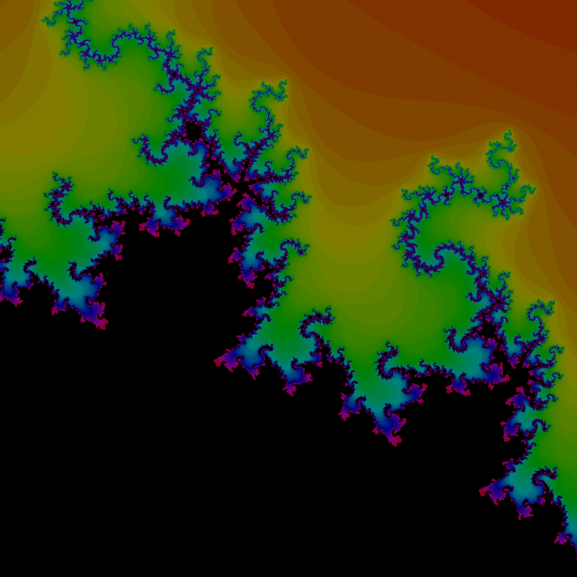

# fractal

Draw some fractals with Rust.




## Supported fractals:

- Mandelbrot black and white and colored

## Running:

```
cargo run -- --width 8192 --height 8192 --colored --center_x -0.9 --center_y 0.25 --real_width 0.1 --real_height 0.1
```